# Grad-CAM with PyTorch

PyTorch implementation of Grad-CAM (Gradient-weighted Class Activation Mapping) [[1](##references)] in image classification. This repository also contains implementations of vanilla backpropagation, guided backpropagation [[2](##references)], deconvnet [[2](##references)], and guided Grad-CAM [[1](##references)], occlusion sensitivity maps [[3](##references)].

## Requirements

Python 2.7 / 3.+

```bash
$ pip install click opencv-python matplotlib tqdm numpy
$ pip install "torch>=0.4.1" torchvision
```

## Basic usage

```sh
python main.py [DEMO_ID] [OPTIONS]
```

Demo ID:

* [`demo1`](#demo-1)
* [`demo2`](#demo-2)
* [`demo3`](#demo-3)

Options:

* ```-i```, ```--image-paths```: image path, which can be provided multiple times (required)
* ```-a```, ```--arch```: a model name from ```torchvision.models```, e.g. "resnet152" (required)
* ```-t```, ```--target-layer```: a module name to be visualized, e.g. "layer4.2" (required)
* ```-k```, ```--topk```: the number of classes to generate (default: 3)
* ```-o```, ```--output-dir```: a directory to store results (default: ./results)
* ```--cuda/--cpu```: GPU or CPU

The command above generates, for top *k* classes:

* Gradients by vanilla backpropagation
* Gradients by guided backpropagation [[2](##references)]
* Gradients by deconvnet [[2](##references)]
* Grad-CAM [[1](##references)]
* Guided Grad-CAM [[1](##references)]

The guided-* do not support `F.relu` but only `nn.ReLU` in this codes.
For instance, off-the-shelf `inception_v3` cannot cut off negative gradients during backward operation (issue #2).

## Demo 1


Generate all kinds of visualization maps given a torchvision model, a target layer, and images.

```bash
python main.py demo1 -a resnet152 -t layer4 \
                     -i samples/cat_dog.png -i samples/vegetables.jpg # You can add more images
```

|              Predicted class               |                       #1 boxer                        |                       #2 bull mastiff                        |                       #3 tiger cat                        |
| :----------------------------------------: | :---------------------------------------------------: | :----------------------------------------------------------: | :-------------------------------------------------------: |
|        Grad-CAM [[1](##references)]        |         |         |    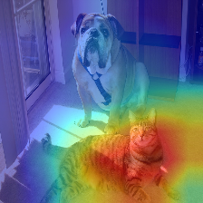     |
|          Vanilla backpropagation           |        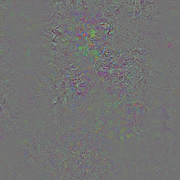        |                |                |
|      "Deconvnet" [[2](##references)]       |       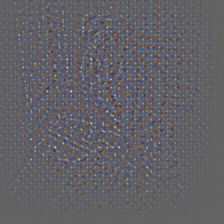       |              |       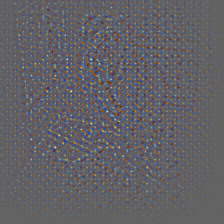       |
| Guided backpropagation [[2](##references)] |        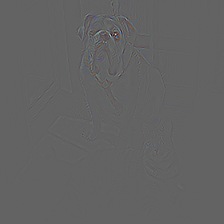         |        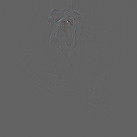         |                 |
|    Guided Grad-CAM [[1](##references)]     | 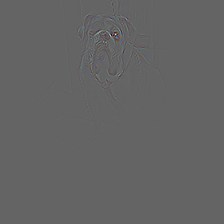 |  |  |

Grad-CAM with different models for "bull mastiff" class

|            Model             |                    ```resnet152```                    |                     ```vgg19```                     |                     ```vgg19_bn```                     |                     ```densenet201```                     |                     ```squeezenet1_1```                     |
| :--------------------------: | :---------------------------------------------------: | :-------------------------------------------------: | :----------------------------------------------------: | :-------------------------------------------------------: | :---------------------------------------------------------: |
|            Layer             |                     ```layer4```                      |                   ```features```                    |                     ```features```                     |                      ```features```                       |                       ```features```                        |
| Grad-CAM [[1](##references)] |  |  | 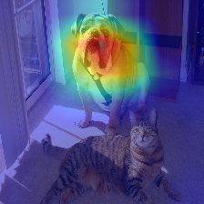 | 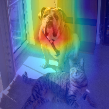 |  |

## Demo 2

Generate Grad-CAM maps for "bull mastiff" class, at different layers of ResNet-152 (hardcoded).

```bash
python main.py demo2 -i samples/cat_dog.png
```

|            Layer             |                     ```relu```                      |                     ```layer1```                      |                     ```layer2```                      |                     ```layer3```                      |                     ```layer4```                      |
| :--------------------------: | :-------------------------------------------------: | :---------------------------------------------------: | :---------------------------------------------------: | :---------------------------------------------------: | :---------------------------------------------------: |
| Grad-CAM [[1](##references)] | 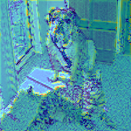 |  | 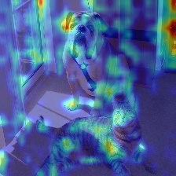 |  |  |

## Demo 3

Generate the occlusion sensitivity map [[1](##references), [3](##references)] based on logit scores.
The red and blue regions indicate a relative increase and decrease from non-occluded scores respectively: the blue regions are critical!

```bash
python main.py demo3 -a resnet152 -i samples/cat_dog.png
```

|           Patch size           |                         10x10                         |                         15x15                         |                         25x25                         |                         35x35                         |                         45x45                         |                         90x90                         |
| :----------------------------: | :---------------------------------------------------: | :---------------------------------------------------: | :---------------------------------------------------: | :---------------------------------------------------: | :---------------------------------------------------: | :---------------------------------------------------: |
|    **"boxer"** sensitivity     |         |         |         |         |         |    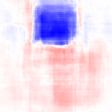     |
| **"bull mastiff"** sensitivity | 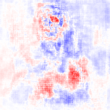 | 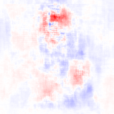 | 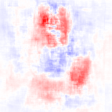 | 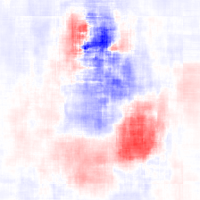 | 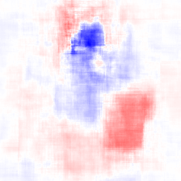 | 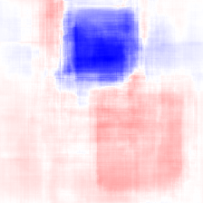 |
|  **"tiger cat"** sensitivity   |  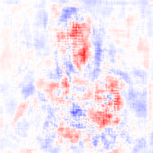   |     |  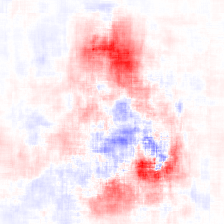   |  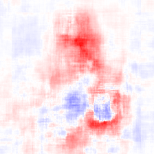   |  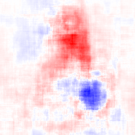   |  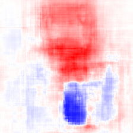   |

This demo takes much time to compute per-pixel logits.
You can control the resolution by changing sampling stride (`--stride`), or increasing batch size as to fit on your GPUs (`--n-batches`). The model is wrapped with `torch.nn.DataParallel` so that runs on multiple GPUs by default.

## References

1. R. R. Selvaraju, A. Das, R. Vedantam, M. Cogswell, D. Parikh, and D. Batra. Grad-CAM: Visual Explanations from Deep Networks via Gradient-based Localization. In *ICCV*, 2017
2. J. T. Springenberg, A. Dosovitskiy, T. Brox, and M. Riedmiller. Striving for Simplicity: The All Convolutional Net. arXiv, 2014
3. M. D. Zeiler, R. Fergus. Visualizing and Understanding Convolutional Networks. In *ECCV*, 2013
