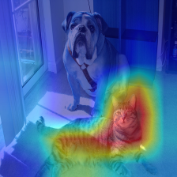
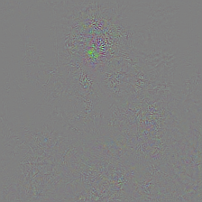
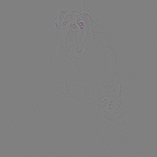
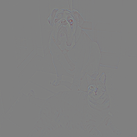
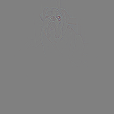
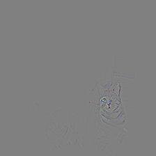

# Grad-CAM with PyTorch

PyTorch implementation of [Grad-CAM (Gradient-weighted Class Activation Mapping) [1]](https://arxiv.org/pdf/1610.02391v1.pdf). Grad-CAM localizes and highlights the discriminative regions that Convolutional Neural Networks-based models activate to predict visual concepts. This code contains only an imeplementation for the VGG-19 image classification models.

## Dependencies
* Python 2.7
* PyTorch

## Usage
```bash
$ python generate.py --image samples/vegetables.jpg
```

## Examples


||bull mastiff|tabby|
|:-:|:-:|:-:|
|**Grad-CAM [1]**|||
|Backpropogation|||
|Guided Backpropagation [2]|||
|**Guided Grad-CAM [1]**|||

## References
\[1\] R. R. Selvaraju, A. Das, R. Vedantam, M. Cogswell, D. Parikh, and D. Batra. "Grad-CAM: Visual Explanations from Deep Networks via Gradient-based Localization". arXiv, 2016<br>
\[2\] J. T. Springenberg, A. Dosovitskiy, T. Brox, and M. Riedmiller. "Striving for Simplicity: The All Convolutional Net". arXiv, 2014