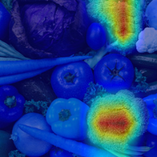

# Grad-CAM with PyTorch

PyTorch implementation of [Grad-CAM (Gradient-weighted Class Activation Mapping) [1]](https://arxiv.org/pdf/1610.02391v1.pdf)

## Dependencies
* Python 2.7
* PyTorch

## Usage
```bash
$ python grad_cam.py [image]
```

## Examples
|Input|Cauliflower|Cucumber|Broccoli|Head cabbage|Zucchini|
|:-:|:-:|:-:|:-:|:-:|:-:|
|||||||

## References
[1] R. R. Selvaraju _et al._ "Grad-CAM: Visual Explanations from Deep Networks via Gradient-based Localization". arXiv, 2016