# Grad-CAM with PyTorch

PyTorch implementation of Grad-CAM (Gradient-weighted Class Activation Mapping) [[1](##references)]. Grad-CAM localizes and highlights discriminative regions that a convolutional neural network-based model activates to predict visual concepts. This repository only supports image classification models.

## Dependencies
* Python 2.7+/3.6+
* PyTorch 0.4.1+
* torchvision 0.2.2+
* click
* opencv
* tqdm

## Basic usage

```sh
python main.py demo1 [OPTIONS]
```

Options:
* ```-i```, ```--image-paths```: image path, which can be provided multiple times (required)
* ```-a```, ```--arch```: a model name from ```torchvision.models```, e.g. "resnet152" (required)
* ```-t```, ```--target-layer```: a module name to be visualized, e.g. "layer4.2" (required)
* ```-k```, ```--topk```: the number of classes to generate (default: 3)
* ```-o```, ```--output-dir```: a directory to store results (default: ./results)
* ```--cuda/--cpu```: GPU or CPU

The command above generates, for top *k* classes:

* Gradients by vanilla backpropagation
* Gradients by guided backpropagation [[2](##references)]
* Gradients by deconvnet [[2](##references)]
* Grad-CAM [[1](##references)]
* Guided Grad-CAM [[1](##references)]

The guided-* do not support `F.relu` but only `nn.ReLU` in this codes.
For instance, off-the-shelf `inception_v3` cannot cut off negative gradients during backward operation (issue #2).

`demo2`, `demo3`, and `demo4` are hard-coded examples.

## Examples

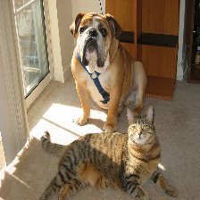

### Demo 1

Generate all kinds of visualization maps given a torchvision model, a target layer, and images.

```bash
python main.py demo1 -a resnet152 \
                     -t layer4 \
                     -i samples/cat_dog.png
```

You can specify multiple images like:

```bash
python main.py demo1 -a resnet152 \
                     -t layer4 \
                     -i samples/cat_dog.png \
                     -i samples/vegetables.jpg
```

|              Predicted class               |                         #1 boxer                         |                         #2 bull mastiff                         |                         #3 tiger cat                         |
| :----------------------------------------: | :------------------------------------------------------: | :-------------------------------------------------------------: | :----------------------------------------------------------: |
|        Grad-CAM [[1](##references)]        |         |    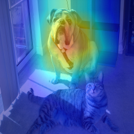     |         |
|          Vanilla backpropagation           |        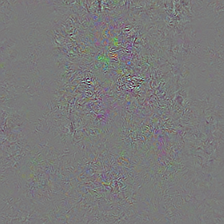        |                |                |
|      "Deconvnet" [[2](##references)]       |              |              |              |
| Guided backpropagation [[2](##references)] |        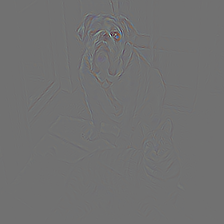         |        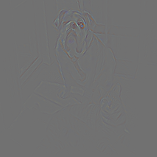         |        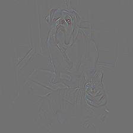         |
|    Guided Grad-CAM [[1](##references)]     | 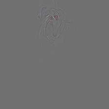 | 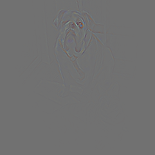 | 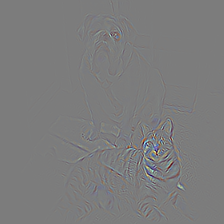 |

Grad-CAM with different models for "bull mastiff" class

|            Model             |                     ```resnet152```                      |                      ```vgg19```                       |                      ```vgg19_bn```                       |                      ```densenet201```                       |                      ```squeezenet1_1```                       |
| :--------------------------: | :------------------------------------------------------: | :----------------------------------------------------: | :-------------------------------------------------------: | :----------------------------------------------------------: | :------------------------------------------------------------: |
|            Layer             |                       ```layer4```                       |                     ```features```                     |                      ```features```                       |                        ```features```                        |                         ```features```                         |
| Grad-CAM [[1](##references)] |  | 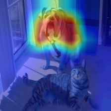 | 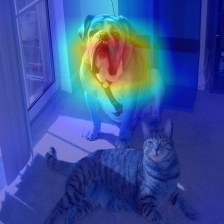 | 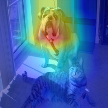 |  |

### Demo 2

Generate Grad-CAM at different layers of ResNet-152 for "bull mastiff" class.

```bash
python main.py demo2 -i samples/cat_dog.png
```

|            Layer             |                       ```relu```                       |                       ```layer1```                       |                       ```layer2```                       |                       ```layer3```                       |                       ```layer4```                       |
| :--------------------------: | :----------------------------------------------------: | :------------------------------------------------------: | :------------------------------------------------------: | :------------------------------------------------------: | :------------------------------------------------------: |
| Grad-CAM [[1](##references)] |  | 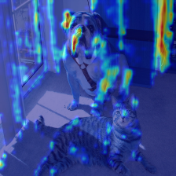 | 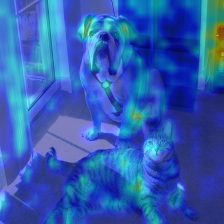 | 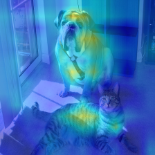 |  |

### Demo 3

Generate Grad-CAM with the original models.
Here we use Xception v1 from my other repo and visualize the response at the last convolution layer (see `demo3()` for more details).
If you want to adapt your own model, please verify the model uses only `nn.ReLU`, not `F.relu`.

```bash
python main.py demo3 -i samples/cat_dog.png
```

|       Predicted class        |                           #1 bull mastiff                           |                           #2 tiger cat                           |                           #3 boxer                           |
| :--------------------------: | :-----------------------------------------------------------------: | :--------------------------------------------------------------: | :----------------------------------------------------------: |
| Grad-CAM [[1](##references)] | 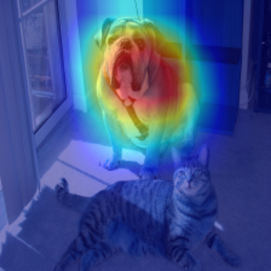 | 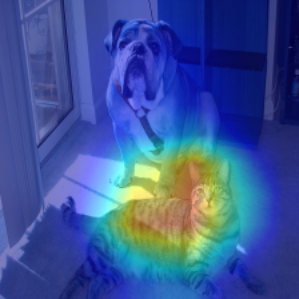 | 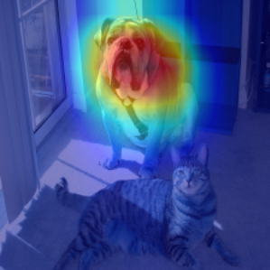 |

### Demo 4

Generate the occlusion sensitivity map [[1](##references), [3](##references)] based on logit scores. 
The red and blue regions indicate a relative increase and decrease from non-occluded scores respectively: the blue regions are critical!

```bash
python main.py demo4 -a resnet152 -i samples/cat_dog.png
```

|           Patch size           |                          10x10                           |                          15x15                           |                          25x25                           |                          35x35                           |                          45x45                           |                          90x90                           |
| :----------------------------: | :------------------------------------------------------: | :------------------------------------------------------: | :------------------------------------------------------: | :------------------------------------------------------: | :------------------------------------------------------: | :------------------------------------------------------: |
|    **"boxer"** sensitivity     |    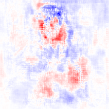     |    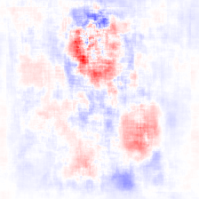     |    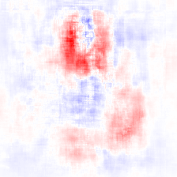     |    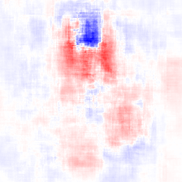     |    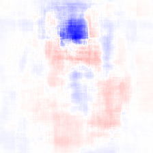     |         |
| **"bull mastiff"** sensitivity |  |  |  |  |  |  |
|  **"tiger cat"** sensitivity   |     |  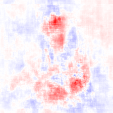   |     |     |     |     |

This demo takes much time to compute per-pixel logits.
You can control the resolution by changing sampling stride (`--stride`), or increasing batch size as to fit on your GPUs (`--n-batches`). The model is wrapped with `torch.nn.DataParallel` so that runs on multiple GPUs by default.

## References

1. R. R. Selvaraju, A. Das, R. Vedantam, M. Cogswell, D. Parikh, and D. Batra. Grad-CAM: Visual Explanations from Deep Networks via Gradient-based Localization. In *ICCV*, 2017
2. J. T. Springenberg, A. Dosovitskiy, T. Brox, and M. Riedmiller. Striving for Simplicity: The All Convolutional Net. arXiv, 2014
3. M. D. Zeiler, R. Fergus. Visualizing and Understanding Convolutional Networks. In *ECCV*, 2013