# Grad-CAM with PyTorch

PyTorch implementation of Grad-CAM (Gradient-weighted Class Activation Mapping) [[1](##references)]. Grad-CAM localizes and highlights discriminative regions that a convolutional neural network-based model activates to predict visual concepts. This repository only supports image classification models.

## Dependencies
* Python 2.7+/3.6+
* PyTorch 0.4.1+
* torchvision 0.2.1+
* click
* opencv

## Usage

```sh
python demo.py --help
```

* ```-i```, ```--image-path```: a path to an image (required)
* ```-a```, ```--arch```: a model name from ```torchvision.models```, e.g. "resnet152" (required)
* ```-t```, ```--target-layer```: a layer to be visualized, e.g. "layer4.2" (required)
* ```-k```, ```--topk```: the number of classes to generate (default: 3)
* ```--cuda/--no-cuda```: GPU or CPU

The command above generates, for top *k* classes:

* Gradients by vanilla backpropagation
* Gradients by guided backpropagation [[2](##references)]
* Gradients by deconvnet [[2](##references)]
* Grad-CAM [[1](##references)]
* Guided Grad-CAM [[1](##references)]

The guided-* do not support F.relu but only nn.ReLU in this codes.
For instance, off-the-shelf *inception_v3* cannot cut off negative gradients during backward operation (#2).

## Examples


### Demo

```bash
python demo.py -a resnet152 \
               -t layer4 \
               -i samples/cat_dog.png
```

|                   Method                   |                         bull mastiff                          |                         tiger cat                          |                         boxer                          |
| :----------------------------------------: | :-----------------------------------------------------------: | :--------------------------------------------------------: | :----------------------------------------------------: |
|                Probability                 |                            0.54285                            |                          0.19302                           |                        0.10428                         |
|        Grad-CAM [[1](##references)]        |    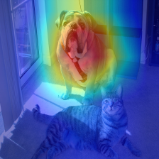     |         |         |
|          Vanilla backpropagation           |        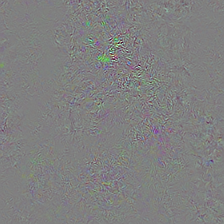        |        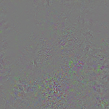        |                |
|      "Deconvnet" [[2](##references)]       |       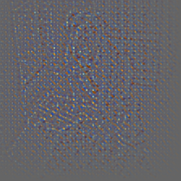       |       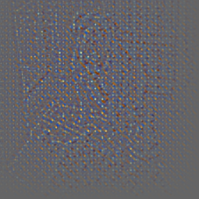       |       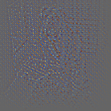       |
| Guided backpropagation [[2](##references)] |        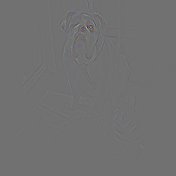         |        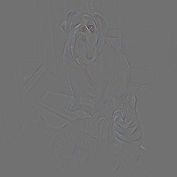         |        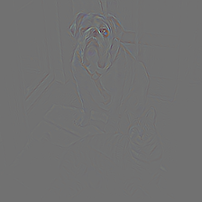         |
|    Guided Grad-CAM [[1](##references)]     | 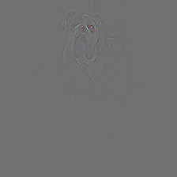 | 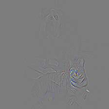 | 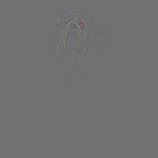 |

### Grad-CAM with different models for "bull mastiff" class

```bash
python demo.py -a <model name> \
               -t <layer name> \
               -i samples/cat_dog.png
```

|            Model             |                    ```resnet152```                     |                     ```vgg19```                      |                     ```vgg19_bn```                      |                     ```densenet201```                      |                     ```squeezenet1_1```                      |
| :--------------------------: | :----------------------------------------------------: | :--------------------------------------------------: | :-----------------------------------------------------: | :--------------------------------------------------------: | :----------------------------------------------------------: |
|            Layer*            |                      ```layer4```                      |                    ```features```                    |                     ```features```                      |                       ```features```                       |                        ```features```                        |
| Grad-CAM [[1](##references)] |  |  |  | 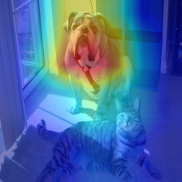 | 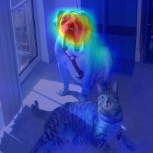 |

\* PyTorch module name

### Grad-CAM at different layers of resnet152 for "bull mastiff" class

```bash
python demo2.py --image-path samples/cat_dog.png
```

|            Layer*            |                      ```layer1```                      |                      ```layer2```                      |                      ```layer3```                      |                      ```layer4```                      |
| :--------------------------: | :----------------------------------------------------: | :----------------------------------------------------: | :----------------------------------------------------: | :----------------------------------------------------: |
| Grad-CAM [[1](##references)] | 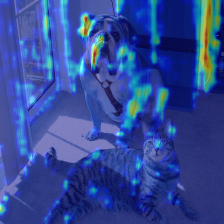 | 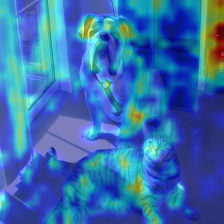 | 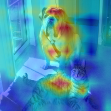 |  |


## References

1. R. R. Selvaraju, A. Das, R. Vedantam, M. Cogswell, D. Parikh, and D. Batra. "Grad-CAM: Visual Explanations from Deep Networks via Gradient-based Localization". arXiv, 2016
2. J. T. Springenberg, A. Dosovitskiy, T. Brox, and M. Riedmiller. "Striving for Simplicity: The All Convolutional Net". arXiv, 2014